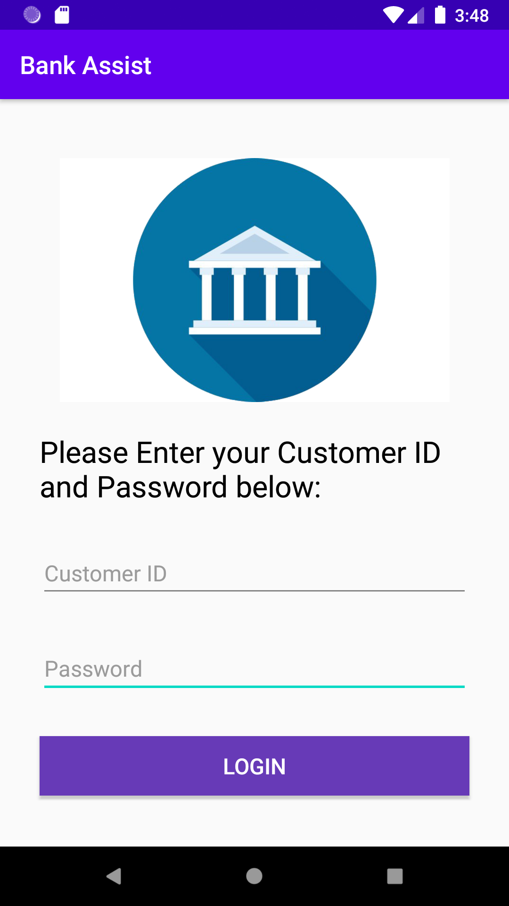
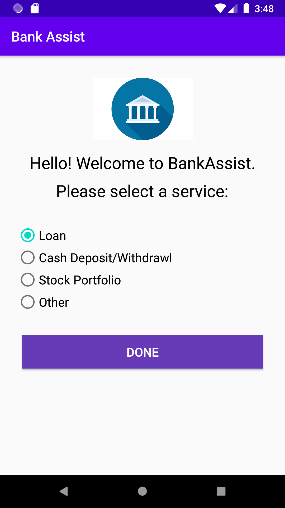
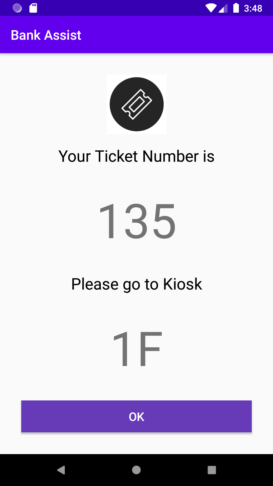
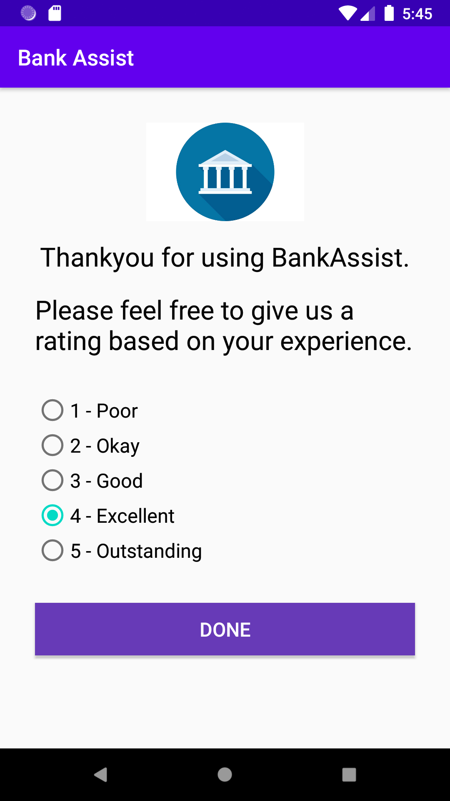

# BankAssist

## Objective

Our ultimate goal is to allow customers to save time in the branch as customers want things to be
done quickly and efficiently. In turn, this frees up time for bank employees to focus their time on
human centric aspects of the branch, such as tasks that require creative thinking and innovation.
Furthermore, employees can also focus their time on providing a more fulfilling experience for
customers

## Background

IoT is an emerging technology in this day and age. Data can be retrieved from sensors, which in turn
can be used to produce useful insights for companies. By 2020, there will be over 26 billion
connected devices. Most banks use apps to create a more convenient for their customers and we are
looking to add it on by creating an app which will make queueing easier, making it a more pleasant
experience and hopefully getting branch tasks done quicker.

## Who is it for?

Developers - People who love to develop apps in order to satisfy the customer’s needs.  

Customers - People who love to book things via an app on the mobile

Banks - Will help their queueing system for their branches and trying to find ways to improve the customer experience

## Assumptions/hardware used

I. Only an Android App will be developed for this project. No iOS App hence only Android
phones are used. Requires Android 10.0 or later.

II. [Bluecats](https://www.bluecats.com/) bluetooth proximity [beacons](http://wwwpress.bluecats.com/buy-beacons/) will be used to detect customers and eventually
collect data.

III. Developed in Kotlin, Javascript and NodeJS. MySQL will be used for databases along with Python for
analytics and machine learning.

IV. Bluecats web app for monitoring and if maintenance is required.

## Application Walkthrough

### Step 1 - Customer Logs In to the Application 

### Step 2 - Customer Selects the Service

Once the user selects the service and click on the button below, the app prompts the user to switch on the bluetooth and
starts watching for a beacon in close range. Once a beacon is detected the application sends a get request to the ticketing API and waits for a response. If a response is received , the application opens the next view to display the Kiosk and ticket details.

### Step 3 - Customer Receives the ticket Number

### Step 4 - Customer gives Feedback

## Running Android Studio from scratch

1.	Download Android Studio from here:
[Android Studio Canary](https://developer.android.com/studio/archive).
Choose Android Studio 4.1 Canary 4 for download.
2.	Install Android Studio and just use the recommended settings.
3.	Now go into the Program files itself and enter the bin folder (/Program Files/Android/android-studio/bin/) 
4.	Click on studio64 and execute it.
5.	Clone the whole Github repository onto your local drive.
6.	Make sure to enable virtualisation on your computer. Hyper-V must be enabled as well. 
7.	Go to ‘Tools’ in Android Studio, and then go to ‘AVD Manager’, then go to ‘Create Virtual Device’. We chose the default phone, which was the Google Pixel 2. Then Click ‘Next’.
8.	Choose Oreo API Level 27. This is Android 8.1. Then click ‘Next’.
9.	Finish the process and wait for the download to finish.
10.	Select the virtual device. A phone like popup should show up. This is the Android Emulator.
11.	Now the phone should contain the app called ‘Bank Assist’. 

## Transferring the Banking App to Android

1.	Connect the Android device to your computer with your USB cable.
2.	Go ‘Settings’ in Android, then go to ‘About Phone’.
3.	Click on ‘Software Information’. Click on ‘Build Number’ 7 times. Now developer mode has been turned on. Go back, scroll down and ‘Developer Options’ should be there.
4.	In ‘Developer Options’, ensure ‘USB debugging’ is on. 
5.	Go to the Play Store and install SideSync. Allow SideSync to do features. 
6.	Download Samsung SideSync from the Samsung website. Download it for PC.
7.	Run SideSync.
8.	Make sure that the Android device is connected to the computer with your USB. Run SideSync on both computer and phone and make sure that it is synced.
9.	Build and run the IoT Banking App on Android Studio. Now select your connected Android device as your deployment target. Click Ok.
10.	Now your app should be running on your phone (make sure that it is not the emulator).
11.	Take a test run though the app. See the above 4 mobile screenshots for reference to see if you are on the right track. Here is a sample below:
Customer ID: 11472
Password: password

## Connecting the Bluecats beacon to Eddystone UID mode

1.	Register for an account on [Bluecats]https://app.bluecats.com/
2.	You will need to be invited as a contributor in the group as a called IoT Bank Branch.
3.	Once invited, go to the Beacons section. You should see if the beacon is in Eddystone UID mode. If it is not, proceed to Step 4.
4.	Click on the Settings button for the beacon (this is represented by the gear).
5.	Go to settings and updates. Turn Eddystone mode on.
6.	Then you will need to download the BC reveal app from the App store or Google Play store from your mobile.
7.	Login into the BC reveal app using your existing account.
8.	Then go to Team -> IoT Bank Branch -> Beacons. Select the beacon you want to update. Then update the settings.
9.	Now go back to the [Bluecats app site]https://app.bluecats.com/. Click on the dashboard and go to the settings to make the final changed to convert to Eddystone UID mode. Note that only the team owner has permission to do this.

## Running the App from the Android phone.
10.	Enter the Customer ID and Password. Make sure it is entered correctly as we get these details from the database.
11.	Select the service you want. There are 6 options: Accounts, ATM, Cheques, Exchange, Loan and General. 
12.	Ensure that it only goes to the next page if you are less than 3 metres from the Bluecats beacon. 
13.	The ticket number should show up.
14.	Rate the Bank Branch experience from 1-5.

NOTE: IF USING SIDESYNC DOES NOT WORK PLEASE USE SAMSUNG FLOW TO SYNC WITH PHONE

1. Go to [this site](http://34.87.233.248:3000/) to enter the dashboard itself.
2. You can play around with the functionality of the dashboard. Examples are deleting entries from the queue.

